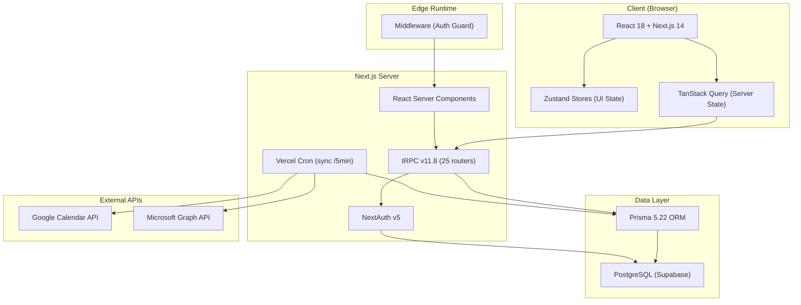
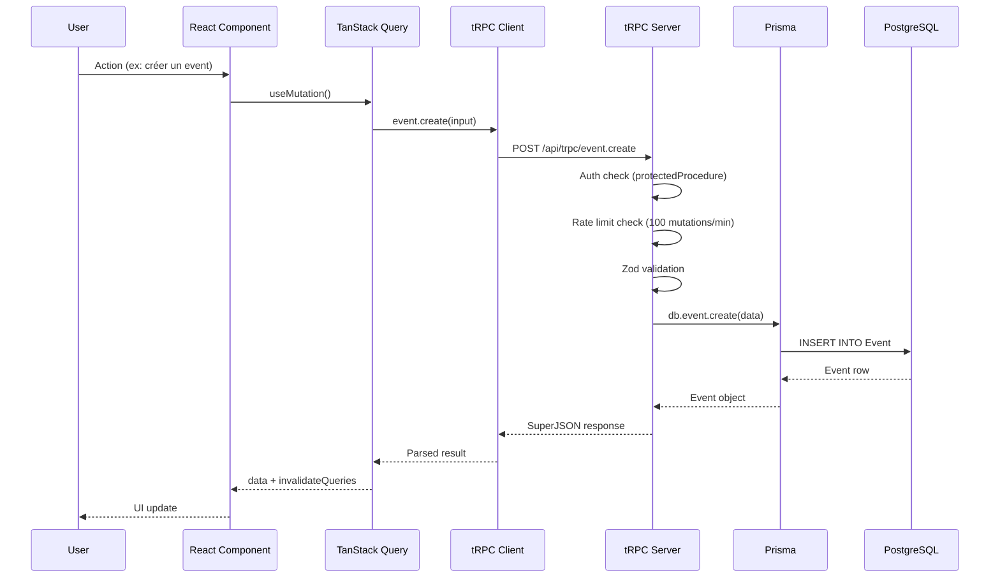

# 🏗️ Architecture

## Vue d'ensemble



---

## Patterns architecturaux

### 1. Feature-First Architecture (Vertical Slices)

Le code est organisé par **domaine métier**, pas par couche technique. Chaque feature est autonome et contient ses propres composants, routers, services et types.

```
src/features/
├── calendar/        # Composants + server + types pour le calendrier
├── tasks/           # Composants + server + types pour les tâches
├── habits/          # Composants + server + types pour les habitudes
├── goals/           # Composants + server + types pour les objectifs
├── focus/           # Timer, anti-procrastination, CBT
├── wellness/        # Chronotype, energy, journal, rituals
├── intelligence/    # IA scheduler, rules engine, experiments
├── analytics/       # Dashboard, workload, meeting load
├── notifications/   # Push notifications, preferences
├── sync/            # Google/Microsoft Calendar sync
├── collaboration/   # Sharing, comments
├── auth/            # Onboarding, user management
└── home/            # Home dashboard, landing page
```

> **ADR-001** : Cette décision est documentée dans `docs/decisions/001-feature-first-architecture.md`.

### 2. Router Thin / Service Fat

Les routers tRPC restent légers (validation + délégation). La logique métier complexe est extraite dans des services (ex : `aiScheduler.service.ts`).

### 3. Séparation Server State / UI State

| Type | Outil | Usage |
|------|-------|-------|
| Server State | tRPC + TanStack Query | Données persistées (events, tasks, habits) |
| UI State | Zustand | État éphémère (modals, filtres, vue active) |

### 4. Edge Middleware pour l'Auth

Le middleware Next.js s'exécute en Edge Runtime. Il vérifie la **présence** d'un cookie de session (pas sa validité) pour rediriger rapidement les visiteurs non authentifiés. La validation complète se fait dans le layout dashboard côté serveur.

### 5. Internationalization (i18n)

- `next-intl` avec support serveur et client
- Français par défaut, anglais supporté
- Fichiers de messages dans `/message/`
- Plugin configuré dans `next.config.mjs`

---

## Data Flow : requête typique



---

## Conventions de nommage

| Élément | Convention | Exemple |
|---------|-----------|---------|
| Fichiers composants | PascalCase | `EventModal.tsx` |
| Fichiers utilitaires | camelCase | `nlp-parser.ts` |
| Routers tRPC | camelCase.router.ts | `event.router.ts` |
| Stores Zustand | camelCase.store.ts | `calendar.store.ts` |
| Modèles Prisma | PascalCase | `CalendarSection` |
| Enums Prisma | SCREAMING_SNAKE | `PENDING_PUSH` |
| Variables d'env | SCREAMING_SNAKE | `ENCRYPTION_KEY` |
| Branches Git | kebab-case | `wave-3-p2-batch` |

---

## Infrastructure de déploiement

| Service | Rôle |
|---------|------|
| **Vercel** | Hébergement Next.js, Edge Functions, Cron Jobs |
| **Supabase** | PostgreSQL managé, Row Level Security |
| **GitHub Actions** | CI (build + lint + tests) |

### Cron Jobs

| Job | Fréquence | Endpoint |
|-----|-----------|----------|
| Calendar Sync | Toutes les 5 minutes | `/api/cron/sync` |

Ce job synchronise les calendriers externes (Google, Microsoft) : refresh des tokens expirés, pull des events, push des events locaux, détection de conflits.
