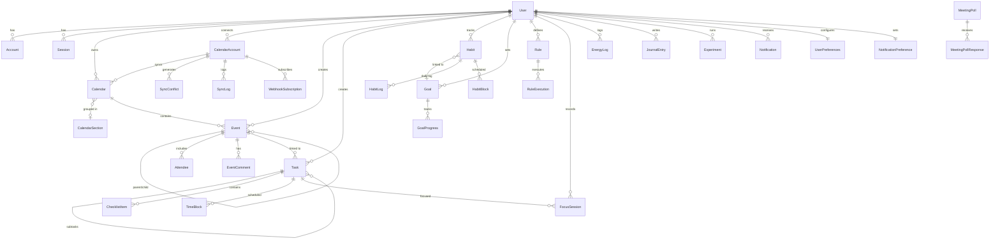

# 🗄️ Schéma de base de données

> Base de données PostgreSQL gérée par **Supabase**, modélisée avec **Prisma 5.22**.

## Diagramme ER (relations principales)

---

## Modèles par domaine

### 1. Authentification

#### User

| Champ | Type | Contrainte | Description |
|-------|------|-----------|-------------|
| id | String | PK, cuid | Identifiant unique |
| name | String? | | Nom affiché |
| email | String | unique | Adresse email |
| emailVerified | DateTime? | | Date de vérification |
| image | String? | | URL de l'avatar |
| timezone | String | default: "UTC" | Fuseau horaire |
| chronotype | Chronotype | default: UNKNOWN | Type circadien |
| onboardingCompleted | Boolean | default: false | Onboarding terminé |
| dailyPriorityCap | Int | default: 3 | Limite de tâches prioritaires/jour |
| dailyFocusGoalMins | Int | default: 120 | Objectif focus quotidien (minutes) |
| createdAt | DateTime | auto | Date de création |
| updatedAt | DateTime | auto | Dernière modification |

**Relations** : accounts, sessions, calendars, calendarSections, events, tasks, rules, habits, goals, recaps, journalEntries, energyLogs, notifications, shareLinks, eventComments, meetingPolls, suggestions, preferences, notificationPrefs, pushSubscriptions, dailyStats, focusSessions, experiments

#### Account

| Champ | Type | Contrainte | Description |
|-------|------|-----------|-------------|
| id | String | PK, cuid | |
| userId | String | FK → User | |
| type | String | | Type de compte |
| provider | String | | Nom du provider OAuth |
| providerAccountId | String | | ID chez le provider |
| refresh_token | String? | @db.Text | Token de refresh |
| access_token | String? | @db.Text | Token d'accès |
| expires_at | Int? | | Expiration (epoch) |
| token_type | String? | | Type de token |
| scope | String? | | Scopes autorisés |
| id_token | String? | @db.Text | Token d'identité |
| session_state | String? | | État de session |

**Unique** : `[provider, providerAccountId]`

#### Session

| Champ | Type | Contrainte |
|-------|------|-----------|
| id | String | PK, cuid |
| sessionToken | String | unique |
| userId | String | FK → User |
| expires | DateTime | |

#### VerificationToken

| Champ | Type | Contrainte |
|-------|------|-----------|
| identifier | String | |
| token | String | unique |
| expires | DateTime | |

**Unique** : `[identifier, token]`

---

### 2. Calendrier

#### CalendarAccount

Connexion à un service externe (Google, Microsoft).

| Champ | Type | Contrainte | Description |
|-------|------|-----------|-------------|
| id | String | PK, cuid | |
| userId | String | FK → User | |
| provider | Provider | | GOOGLE, MICROSOFT, LOCAL |
| email | String | | Email du compte externe |
| accessToken | String | @db.Text | Token chiffré AES-256-GCM |
| refreshToken | String? | @db.Text | Token de refresh chiffré |
| expiresAt | DateTime? | | Expiration du token |
| syncToken | String? | | Token de sync incrémentale |
| webhookId | String? | | ID webhook externe |
| webhookExpiry | DateTime? | | Expiration du webhook |
| isActive | Boolean | default: true | |
| isPrimary | Boolean | default: false | |
| syncDirection | SyncDirection | default: FULL | PULL, PUSH, FULL |
| syncInterval | Int | default: 15 | Minutes entre syncs |
| lastSyncAt | DateTime? | | Dernière sync |
| lastError | String? | | Dernière erreur |

**Unique** : `[userId, provider, email]`

#### Calendar

| Champ | Type | Contrainte | Description |
|-------|------|-----------|-------------|
| id | String | PK, cuid | |
| userId | String | FK → User | |
| calendarAccountId | String? | FK → CalendarAccount | null si local |
| sectionId | String? | FK → CalendarSection | |
| externalId | String? | | ID chez le provider |
| name | String | | Nom du calendrier |
| description | String? | | |
| color | String | default: "#3B82F6" | Couleur hex |
| isDefault | Boolean | default: false | Calendrier par défaut |
| isVisible | Boolean | default: true | Affiché dans l'UI |
| canEdit | Boolean | default: true | Modifiable |
| provider | Provider | default: LOCAL | |

**Unique** : `[calendarAccountId, externalId]`

#### CalendarSection

Groupement de calendriers dans la sidebar.

| Champ | Type | Contrainte |
|-------|------|-----------|
| id | String | PK, cuid |
| userId | String | FK → User |
| name | String | |
| color | String? | |
| icon | String? | |
| position | Int | default: 0 |
| isExpanded | Boolean | default: true |

#### Event

| Champ | Type | Contrainte | Description |
|-------|------|-----------|-------------|
| id | String | PK, cuid | |
| userId | String | FK → User | |
| calendarId | String | FK → Calendar | |
| externalId | String? | | ID externe (Google/Microsoft) |
| title | String | | |
| description | String? | @db.Text | |
| location | String? | | |
| startAt | DateTime | | Début |
| endAt | DateTime | | Fin |
| duration | Int | | Durée calculée (minutes) |
| isAllDay | Boolean | default: false | |
| timezone | String | default: "UTC" | |
| actualStartAt | DateTime? | | Heure réelle de début |
| actualEndAt | DateTime? | | Heure réelle de fin |
| rrule | String? | | Règle de récurrence (RFC 5545) |
| recurrenceId | String? | | ID d'instance récurrente |
| parentEventId | String? | FK → Event | Event parent |
| excludeDates | DateTime[] | | Dates exclues de la récurrence |
| provider | Provider | default: LOCAL | |
| syncStatus | SyncStatus | default: SYNCED | |
| lastSyncAt | DateTime? | | |
| etag | String? | | Version pour la sync |
| color | String? | | Surcharge couleur calendrier |
| reminderMinutes | Int[] | default: [15] | Rappels (minutes avant) |
| status | EventStatus | default: CONFIRMED | |
| visibility | Visibility | default: DEFAULT | |

**Unique** : `[calendarId, externalId]`
**Index** : `[startAt, endAt]`

#### Attendee

| Champ | Type | Contrainte |
|-------|------|-----------|
| id | String | PK, cuid |
| eventId | String | FK → Event |
| email | String | |
| name | String? | |
| status | AttendeeStatus | default: PENDING |
| isOrganizer | Boolean | default: false |
| isOptional | Boolean | default: false |
| comment | String? | |

**Unique** : `[eventId, email]`

---

### 3. Tâches

#### Task

| Champ | Type | Contrainte | Description |
|-------|------|-----------|-------------|
| id | String | PK, cuid | |
| userId | String | FK → User | |
| title | String | | |
| description | String? | @db.Text | |
| notes | String? | @db.Text | |
| url | String? | | Lien externe |
| dueAt | DateTime? | | Échéance |
| plannedStartAt | DateTime? | | Début planifié |
| plannedDuration | Int? | | Durée estimée (minutes) |
| actualDuration | Int? | | Durée réelle (minutes) |
| priority | Priority | default: MEDIUM | |
| status | TaskStatus | default: TODO | |
| tags | String[] | default: [] | |
| estimatedEnergy | EnergyLevel? | | Énergie requise |
| actualEnergy | EnergyLevel? | | Énergie réelle |
| parentTaskId | String? | FK → Task | Tâche parente |
| position | Int | default: 0 | Ordre de tri |
| isRecurring | Boolean | default: false | |
| rrule | String? | | Récurrence |
| linkedEventId | String? | FK → Event | Event lié |
| completedAt | DateTime? | | Date de complétion |

#### ChecklistItem

| Champ | Type | Contrainte |
|-------|------|-----------|
| id | String | PK, cuid |
| taskId | String | FK → Task |
| title | String | |
| isCompleted | Boolean | default: false |
| position | Int | default: 0 |

#### TimeBlock

Bloc de temps planifié pour une tâche.

| Champ | Type | Contrainte |
|-------|------|-----------|
| id | String | PK, cuid |
| taskId | String | FK → Task |
| eventId | String? | |
| startAt | DateTime | |
| endAt | DateTime | |
| duration | Int | minutes |
| status | TimeBlockStatus | default: SCHEDULED |

#### FocusSession

| Champ | Type | Contrainte | Description |
|-------|------|-----------|-------------|
| id | String | PK, cuid | |
| userId | String | FK → User | |
| taskId | String? | FK → Task | |
| startedAt | DateTime | | |
| endedAt | DateTime? | | |
| plannedMins | Int | | Durée prévue |
| actualMins | Int? | | Durée réelle |
| preset | String | | pomodoro_25_5, pomodoro_50_10, deep_90, custom |
| completed | Boolean | default: false | |
| interruptions | Int | default: 0 | Nombre d'interruptions |

**Index** : `[userId, startedAt]`

---

### 4. Intelligence (Rules Engine)

#### Rule

| Champ | Type | Contrainte | Description |
|-------|------|-----------|-------------|
| id | String | PK, cuid | |
| userId | String | FK → User | |
| name | String | | |
| description | String? | | |
| isActive | Boolean | default: true | |
| priority | Int | default: 0 | |
| ruleType | RuleType | default: AUTO_SCHEDULE | |
| schedule | String? | | Expression cron |
| dayTypes | String[] | default: [] | |
| conditions | Json | | Conditions de déclenchement |
| actions | Json | | Actions à exécuter |
| triggerType | TriggerType | | |
| lastTriggeredAt | DateTime? | | |
| triggerCount | Int | default: 0 | |

#### RuleExecution

| Champ | Type | Contrainte |
|-------|------|-----------|
| id | String | PK, cuid |
| ruleId | String | FK → Rule |
| triggeredBy | String? | |
| result | Json? | |
| success | Boolean | |
| message | String? | |
| executedAt | DateTime | auto |

---

### 5. Habitudes & Objectifs

#### Habit

| Champ | Type | Contrainte | Description |
|-------|------|-----------|-------------|
| id | String | PK, cuid | |
| userId | String | FK → User | |
| name | String | | |
| description | String? | | |
| color | String | default: "#3B82F6" | |
| icon | String? | | |
| habitType | HabitType | default: FLEXIBLE | FIXED, FLEXIBLE, CONDITIONAL |
| frequency | HabitFrequency | default: DAILY | DAILY, WEEKLY, MONTHLY, CUSTOM |
| targetCount | Int | default: 1 | Objectif par période |
| duration | Int? | | Durée en minutes |
| preferredTime | String? | | Heure préférée (HH:mm) |
| preferredDays | Int[] | default: [] | Jours préférés (0-6) |
| isProtected | Boolean | default: false | Exclue du rescheduling |
| isActive | Boolean | default: true | |
| currentStreak | Int | default: 0 | Série actuelle |
| longestStreak | Int | default: 0 | Meilleure série |
| goalId | String? | FK → Goal | Objectif lié |

#### HabitLog

| Champ | Type | Contrainte |
|-------|------|-----------|
| id | String | PK, cuid |
| habitId | String | FK → Habit |
| date | DateTime | @db.Date |
| completed | Boolean | default: false |
| count | Int | default: 0 |
| duration | Int? | minutes |
| notes | String? | |
| mood | Int? | 1-5 |

**Unique** : `[habitId, date]`

#### HabitBlock

| Champ | Type | Contrainte |
|-------|------|-----------|
| id | String | PK, cuid |
| habitId | String | FK → Habit |
| eventId | String? | |
| startAt | DateTime | |
| endAt | DateTime | |

#### Goal

| Champ | Type | Contrainte | Description |
|-------|------|-----------|-------------|
| id | String | PK, cuid | |
| userId | String | FK → User | |
| title | String | | |
| description | String? | | |
| category | String? | | Santé, Carrière, etc. |
| targetType | GoalTargetType | default: CUMULATIVE | |
| targetValue | Float | | Valeur cible |
| currentValue | Float | default: 0 | Progression actuelle |
| unit | String? | | Unité de mesure |
| startDate | DateTime | auto | |
| endDate | DateTime? | | Échéance |
| status | GoalStatus | default: ACTIVE | |

#### GoalProgress

| Champ | Type | Contrainte |
|-------|------|-----------|
| id | String | PK, cuid |
| goalId | String | FK → Goal |
| date | DateTime | @db.Date |
| value | Float | |
| notes | String? | |

#### DailyStats

| Champ | Type | Contrainte |
|-------|------|-----------|
| id | String | PK, cuid |
| userId | String | FK → User |
| date | DateTime | @db.Date |
| totalScheduledMins | Int | default: 0 |
| totalActualMins | Int | default: 0 |
| focusTimeMins | Int | default: 0 |
| meetingTimeMins | Int | default: 0 |
| breakTimeMins | Int | default: 0 |
| tasksPlanned | Int | default: 0 |
| tasksCompleted | Int | default: 0 |
| habitsCompleted | Int | default: 0 |
| overloadScore | Float? | |
| balanceScore | Float? | |

**Unique** : `[userId, date]`

---

### 6. Bien-être & Analytics

#### Recap

| Champ | Type | Contrainte |
|-------|------|-----------|
| id | String | PK, cuid |
| userId | String | FK → User |
| recapType | RecapType | DAILY, WEEKLY, MONTHLY |
| periodStart | DateTime | |
| periodEnd | DateTime | |
| summary | Json | |
| highlights | String[] | default: [] |
| improvements | String[] | default: [] |
| insights | String[] | default: [] |
| userNotes | String? | |
| rating | Int? | 1-5 |

**Unique** : `[userId, recapType, periodStart]`

#### JournalEntry

| Champ | Type | Contrainte |
|-------|------|-----------|
| id | String | PK, cuid |
| userId | String | FK → User |
| date | DateTime | @db.Date |
| prompt | String? | |
| content | String | @db.Text |
| mood | Int? | 1-5 |
| tags | String[] | default: [] |

#### EnergyLog

| Champ | Type | Contrainte |
|-------|------|-----------|
| id | String | PK, cuid |
| userId | String | FK → User |
| timestamp | DateTime | auto |
| energyLevel | Int | 1-5 |
| mood | Int? | 1-5 |
| stress | Int? | 1-5 |
| focus | Int? | 1-5 |
| notes | String? | |

#### Notification

| Champ | Type | Contrainte |
|-------|------|-----------|
| id | String | PK, cuid |
| userId | String | FK → User |
| type | NotificationType | |
| title | String | |
| body | String? | |
| data | Json? | |
| priority | NotificationPriority | default: NORMAL |
| status | NotificationStatus | default: PENDING |
| scheduledFor | DateTime? | |
| sentAt | DateTime? | |
| readAt | DateTime? | |

#### NotificationPreference

| Champ | Type | Contrainte |
|-------|------|-----------|
| id | String | PK, cuid |
| userId | String | unique FK → User |
| enablePush | Boolean | default: true |
| enableEmail | Boolean | default: false |
| quietHoursStart | String? | HH:mm |
| quietHoursEnd | String? | HH:mm |
| typeSettings | Json? | |

#### PushSubscription

| Champ | Type | Contrainte |
|-------|------|-----------|
| id | String | PK, cuid |
| userId | String | FK → User |
| endpoint | String | @db.Text |
| p256dh | String | |
| auth | String | |

**Unique** : `[userId, endpoint]`

---

### 7. Collaboration

#### UserPreferences

| Champ | Type | Contrainte | Description |
|-------|------|-----------|-------------|
| id | String | PK, cuid | |
| userId | String | unique FK | |
| theme | String | default: "system" | system, dark, light |
| accentColor | String | default: "#3B82F6" | |
| language | String | default: "fr" | fr, en |
| dateFormat | String | default: "dd/MM/yyyy" | |
| timeFormat | String | default: "24h" | 12h, 24h |
| firstDayOfWeek | Int | default: 1 | 0=Dim, 1=Lun |
| compactMode | Boolean | default: false | |
| showWeekNumbers | Boolean | default: false | |
| defaultCalendarId | String? | | |
| workingHoursStart | String | default: "09:00" | |
| workingHoursEnd | String | default: "18:00" | |
| weeklyWorkHours | Json? | | Horaires par jour |
| customShortcuts | Json? | | |
| dashboardWidgets | Json? | | |
| planningTime | String | default: "morning" | |
| dailyWorkHours | Int | default: 8 | |

#### ShareLink

| Champ | Type | Contrainte |
|-------|------|-----------|
| id | String | PK, cuid |
| userId | String | FK → User |
| token | String | unique, auto cuid |
| type | ShareType | |
| permission | SharePermission | default: VIEW |
| resourceType | String | |
| resourceId | String? | |
| expiresAt | DateTime? | |
| accessCount | Int | default: 0 |
| isActive | Boolean | default: true |

#### EventComment

| Champ | Type | Contrainte |
|-------|------|-----------|
| id | String | PK, cuid |
| eventId | String | FK → Event |
| userId | String | FK → User |
| content | String | @db.Text |

#### MeetingPoll / MeetingPollResponse

Sondage pour trouver un créneau commun (type Calendly/Doodle).

- **MeetingPoll** : title, proposedSlots (Json), duration, deadline, finalSlot, token (public)
- **MeetingPollResponse** : email, name, votes (Json), comment

#### PublicHoliday

| Champ | Type | Contrainte |
|-------|------|-----------|
| id | String | PK, cuid |
| country | String | |
| region | String? | |
| name | String | |
| date | DateTime | @db.Date |
| type | String? | national, regional, observance |

**Unique** : `[country, date, name]`

---

### 8. Sync

#### SyncConflict

| Champ | Type | Contrainte |
|-------|------|-----------|
| id | String | PK, cuid |
| calendarAccountId | String | FK → CalendarAccount |
| eventId | String? | |
| localData | Json | |
| remoteData | Json | |
| conflictType | ConflictType | |
| resolution | ConflictResolution? | |
| resolvedAt | DateTime? | |

#### SyncLog

| Champ | Type | Contrainte |
|-------|------|-----------|
| id | String | PK, cuid |
| calendarAccountId | String | FK |
| direction | SyncDirection | |
| status | SyncLogStatus | |
| itemsProcessed | Int | default: 0 |
| itemsFailed | Int | default: 0 |
| errorMessage | String? | |
| details | Json? | |
| startedAt | DateTime | auto |
| completedAt | DateTime? | |

#### WebhookSubscription

| Champ | Type | Contrainte |
|-------|------|-----------|
| id | String | PK, cuid |
| calendarAccountId | String | FK |
| provider | Provider | |
| resourceId | String | |
| channelId | String | unique |
| expiration | DateTime | |

---

### 9. Science & Intelligence

#### Experiment

N-of-1 experiment lab pour tester des hypothèses personnelles.

| Champ | Type | Contrainte |
|-------|------|-----------|
| id | String | PK, cuid |
| userId | String | FK → User |
| hypothesis | String | @db.Text |
| metric | String | |
| baselineValue | Float? | |
| interventionValue | Float? | |
| startedAt | DateTime | auto |
| endedAt | DateTime? | |
| result | ExperimentResult | default: PENDING |
| notes | String? | @db.Text |

#### AuditLog

Journal d'audit pour conformité Loi 25.

| Champ | Type | Contrainte |
|-------|------|-----------|
| id | String | PK, cuid |
| userId | String? | |
| userEmail | String | |
| action | String | |
| metadata | Json? | |
| ipAddress | String? | |
| userAgent | String? | |
| createdAt | DateTime | auto |

#### Suggestion

| Champ | Type | Contrainte |
|-------|------|-----------|
| id | String | PK, cuid |
| userId | String | FK → User |
| type | SuggestionType | |
| title | String | |
| description | String? | |
| actionData | Json? | |
| confidence | Float | default: 0.5 |
| status | SuggestionStatus | default: PENDING |

---

## Tous les enums

| Enum | Valeurs |
|------|---------|
| **Chronotype** | LARK, OWL, THIRD_BIRD, UNKNOWN |
| **Provider** | GOOGLE, MICROSOFT, LOCAL |
| **SyncDirection** | PULL, PUSH, FULL |
| **SyncStatus** | SYNCED, PENDING_PUSH, PENDING_PULL, CONFLICT, ERROR |
| **SyncLogStatus** | IN_PROGRESS, COMPLETED, FAILED, PARTIAL |
| **ConflictType** | UPDATE_CONFLICT, DELETE_CONFLICT, CREATE_CONFLICT |
| **ConflictResolution** | USE_LOCAL, USE_REMOTE, MERGE, SKIP |
| **EventStatus** | CONFIRMED, TENTATIVE, CANCELLED |
| **Visibility** | DEFAULT, PUBLIC, PRIVATE, CONFIDENTIAL |
| **AttendeeStatus** | PENDING, ACCEPTED, DECLINED, TENTATIVE |
| **Priority** | LOW, MEDIUM, HIGH, URGENT |
| **TaskStatus** | TODO, IN_PROGRESS, DONE, CANCELLED |
| **EnergyLevel** | LOW, MEDIUM, HIGH |
| **TimeBlockStatus** | SCHEDULED, IN_PROGRESS, COMPLETED, CANCELLED |
| **RuleType** | PROTECTION, AUTO_SCHEDULE, BREAK, CONDITIONAL |
| **TriggerType** | EVENT_CREATED, EVENT_UPDATED, TIME_BASED, MANUAL |
| **HabitType** | FIXED, FLEXIBLE, CONDITIONAL |
| **HabitFrequency** | DAILY, WEEKLY, MONTHLY, CUSTOM |
| **GoalTargetType** | CUMULATIVE, STREAK, COMPLETION |
| **GoalStatus** | ACTIVE, COMPLETED, PAUSED, ABANDONED |
| **RecapType** | DAILY, WEEKLY, MONTHLY |
| **ShareType** | CALENDAR, AVAILABILITY, EVENT, TASK_LIST |
| **SharePermission** | VIEW, EDIT, ADMIN |
| **NotificationType** | EVENT_REMINDER, TASK_DUE, HABIT_REMINDER, BREAK_REMINDER, DAILY_RECAP, SUGGESTION, SYNC_ERROR, SYSTEM |
| **NotificationPriority** | LOW, NORMAL, HIGH, URGENT |
| **NotificationStatus** | PENDING, SENT, READ, DISMISSED, FAILED |
| **ExperimentResult** | PENDING, SUCCESS, FAILURE, INCONCLUSIVE |
| **SuggestionType** | RESCHEDULE, AUTO_SCHEDULE, BREAK_REMINDER, HABIT_REMINDER, CONFLICT_RESOLUTION, OPTIMIZATION |
| **SuggestionStatus** | PENDING, ACCEPTED, DISMISSED, EXPIRED |
