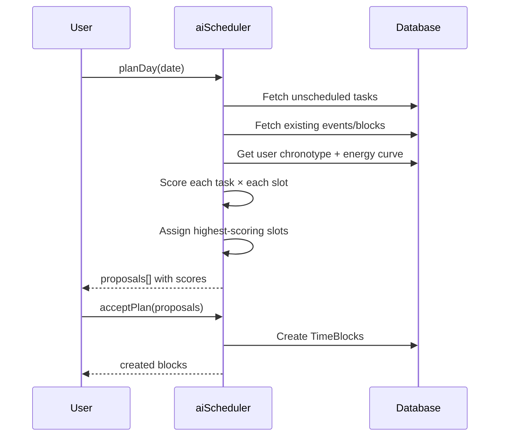

# 🧠 Intelligence

## Vue d'ensemble

Le module d'intelligence regroupe l'**AI Scheduler** ("Planifier ma journée"), le **Rules Engine** (automatisation), les **Suggestions** de créneaux, et le **N-of-1 Experiment Lab**.

---

## AI Scheduler — "Planifier ma journée"

### Fonctionnement

Le scheduler analyse les tâches non planifiées et génère un plan optimal en considérant :

1. **Chronotype** : Courbe énergétique de l'utilisateur (LARK/OWL/THIRD_BIRD)
2. **Énergie requise** : Match HIGH energy tasks → pic circadien
3. **Slots disponibles** : Évite les events, time blocks, et focus blocks existants
4. **Priorité** : URGENT et HIGH d'abord
5. **Durée calibrée** : Utilise l'historique des estimations pour corriger les biais

### Flux



### Procédures

| Procédure | Type | Description |
|-----------|------|-------------|
| `planDay` | query | Générer un plan optimal pour la date |
| `acceptPlan` | mutation | Créer les time blocks du plan |
| `replan` | mutation | Re-planifier après un déplacement |
| `applyReplan` | mutation | Appliquer la re-planification |
| `getCalibratedEstimate` | query | Estimation calibrée avec historique |
| `recordActualDuration` | mutation | Enregistrer durée réelle |
| `getFocusBlocks` | query | Blocs focus immovables |
| `createFocusBlock` | mutation | Créer un bloc focus |
| `getStats` | query | Précision des estimations |

### Calibration des estimations

Le système apprend des estimations passées :
- **calibrationFactor** : Ratio moyen `actualDuration / plannedDuration`
- **recommendation** : "Vous sous-estimez de 30% — ajuster vos estimations à la hausse"
- Alimenté par `recordActualDuration` appelé depuis le focus timer

### Composants

| Composant | Rôle |
|-----------|------|
| `PlanMyDay.tsx` | Interface de revue et acceptation du plan |
| `CalibrationStats.tsx` | Statistiques de précision |

---

## Rules Engine

### Concept

Les règles permettent d'automatiser des comportements :
- **PROTECTION** : Protéger des créneaux (ex: "pas de meeting avant 10h")
- **AUTO_SCHEDULE** : Planifier automatiquement (ex: "ajouter 30min de lecture chaque soir")
- **BREAK** : Forcer des pauses (ex: "pause de 15min après 90min de focus")
- **CONDITIONAL** : Actions contextuelles (ex: "si >3 meetings, bloquer 1h de décompression")

### Structure d'une règle

```json
{
  "name": "Protection matinale",
  "ruleType": "PROTECTION",
  "triggerType": "EVENT_CREATED",
  "conditions": [
    { "field": "startAt", "operator": "before", "value": "10:00" }
  ],
  "actions": [
    { "type": "block_time", "params": { "from": "07:00", "to": "10:00" } }
  ],
  "dayTypes": ["weekday"],
  "isActive": true
}
```

### Templates pré-construits

Le router fournit des templates via `rule.getTemplates` :
- Focus Time (bloquer du temps de travail profond)
- Lunch Break (protéger la pause déjeuner)
- Meeting Buffer (tampon entre les réunions)

### Composants

| Composant | Rôle |
|-----------|------|
| `RuleCard.tsx` | Carte avec toggle activation |
| `RuleModal.tsx` | Formulaire de création/édition |

---

## Suggestions de créneaux

Le router `suggestion.getOptimalSlots` trouve les meilleurs créneaux pour une activité :

- Score basé sur : disponibilité, énergie, habitudes passées
- Retourne les **Top 5** créneaux avec score et justification
- `energyMatch` indique si le créneau est aligné avec la courbe énergétique

### Composant

`SlotSuggestions.tsx` : Affiche les créneaux suggérés avec scores.

---

## N-of-1 Experiment Lab

### Concept

Chaque utilisateur peut mener des **expériences personnelles** pour tester des hypothèses sur sa productivité :

1. **Hypothèse** : "Commencer par la tâche la plus difficile augmente ma productivité"
2. **Métrique** : "Nombre de tâches complétées avant midi"
3. **Baseline** : Semaine sans intervention
4. **Intervention** : Semaine avec la règle appliquée
5. **Résultat** : SUCCESS, FAILURE, INCONCLUSIVE

### Procédures

| Procédure | Type | Description |
|-----------|------|-------------|
| `create` | mutation | Créer une expérience |
| `list` | query | Lister (filtrer par résultat) |
| `complete` | mutation | Compléter avec résultat |
| `delete` | mutation | Supprimer |

### Composant

`ExperimentsList.tsx` : Liste des expériences avec statut et résultats.

---

## NLP Quick Capture

Le parser `src/shared/lib/nlp-parser.ts` permet la création de tâches en langage naturel :

```
"Réunion avec Marc demain à 14h" → { title: "Réunion avec Marc", date: tomorrow 14:00 }
"Acheter du lait vendredi" → { title: "Acheter du lait", date: friday }
```

- **Librairie** : Chrono-node pour l'extraction de dates
- **Langues** : Français et anglais
- **Retour** : `{ title, parsedDate, dateText, confidence, language, isActionable }`

---

## Issues ouvertes liées

| # | Titre | Priorité |
|---|-------|----------|
| #88 | AI Adaptive Rescheduling | P0 |
| #107 | Quick Capture NLP — UI | P1 |
| #108 | AI Daily Brief | P2 |
