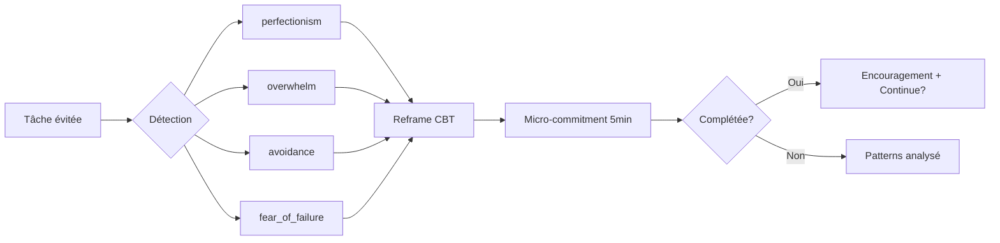

# 🎯 Focus Hub

## Vue d'ensemble

Le Focus Hub combine un **timer configurable** (Pomodoro et sessions longues), un système **anti-procrastination** basé sur la CBT (Cognitive Behavioral Therapy), et un **tracking de sessions** avec analytics.

> **EPIC** : [#116](https://github.com/ralphgabriel04/dpm-calendar/issues/116) — Focus Hub (27 story points)

---

## Timer Engine

### Presets disponibles

| Preset | Travail | Pause | Usage |
|--------|---------|-------|-------|
| `pomodoro_25_5` | 25 min | 5 min | Standard Pomodoro |
| `pomodoro_50_10` | 50 min | 10 min | Pomodoro étendu |
| `deep_90` | 90 min | - | Deep work (flow state) |
| `custom` | Variable | Variable | Libre |

### Composants

| Composant | Rôle |
|-----------|------|
| `FocusMode.tsx` | Interface full-screen du focus timer |
| `FocusProgressRing.tsx` | Anneau de progression visuel avec objectif quotidien et streak |
| `FocusTaskPicker.tsx` | Sélecteur rapide de tâche pour la session |
| `MicroCommitment.tsx` | Widget micro-engagement avec timer |

### Objectif quotidien

- **Défaut** : 120 minutes de focus par jour (`User.dailyFocusGoalMins`)
- **Progress Ring** : Affiche le pourcentage atteint
- **Streak** : Nombre de jours consécutifs où l'objectif est atteint

---

## Router `focusSession` (6 procédures)

| Procédure | Type | Description |
|-----------|------|-------------|
| `start` | mutation | Démarrer une session (preset + tâche optionnelle) |
| `stop` | mutation | Arrêter, calcule `actualMins` |
| `pause` | mutation | Pause (incrémente `interruptions`) |
| `resume` | mutation | Reprendre |
| `list` | query | Sessions récentes (avec tâche liée) |
| `todayStats` | query | Stats du jour : totalMins, sessions, streak, % objectif |

### Modèle `FocusSession`

```
id, userId, taskId?, startedAt, endedAt?, plannedMins, actualMins?,
preset, completed, interruptions
```

---

## Anti-Procrastination (CBT)

### Concept

Quand un utilisateur évite une tâche, le système propose un **micro-commitment** (2-10 minutes) et un **reframe cognitif** basé sur la CBT.

### Types de détection

| Type | Distorsion cognitive | Exemple de reframe |
|------|---------------------|-------------------|
| `perfectionism` | Tout-ou-rien | "Done imperfectly beats perfect-and-unstarted" |
| `overwhelm` | Catastrophisation | "You just have to start the smallest possible piece" |
| `avoidance` | Évitement expérientiel | "The discomfort of starting is usually worse than doing" |
| `fear_of_failure` | Fortune telling | "The only real failure is not trying" |
| `generic` | Général | Reframe général |

### Bibliothèque CBT

`src/features/focus/lib/cbtReframes.ts` contient **18 reframes** structurés :

```typescript
{
  detectionType: "perfectionism",
  distortion: "All-or-nothing thinking",
  reframe: "Progress over perfection. A rough draft beats a blank page.",
  microAction: "Write just one imperfect sentence or line of code"
}
```

### Router `antiProcrastination` (7 procédures)

| Procédure | Type | Description |
|-----------|------|-------------|
| `getQuickStarts` | query | Micro-commitments pour tâches en attente |
| `startMicroSession` | mutation | Démarrer micro-session (5-30 min), set task IN_PROGRESS |
| `completeMicroSession` | mutation | Compléter, option de continuation |
| `reportAvoidance` | mutation | Reporter évitement → reframe CBT |
| `getReframe` | query | Obtenir un reframe à la demande |
| `getPatterns` | query | Patterns de procrastination (30 jours) |
| `checkIn` | query | Tâches qui tiennent dans le temps disponible |

### Flux anti-procrastination



---

## Focus Blocks (Attention Shield)

Les focus blocks sont des blocs **immovables** dans le calendrier que l'AI Scheduler ne peut pas déplacer.

### Procédures

| Procédure | Description |
|-----------|-------------|
| `getFocusBlocks` | Obtenir les blocs focus du jour |
| `createFocusBlock` | Créer un bloc (15-240 min) |

### Règles

- Un focus block **rejette** tout event conflicting (même heure)
- Les events adjacents (fin = début) sont autorisés
- L'energy overlap detection identifie les conflits d'énergie

---

## Stats et Analytics

`todayStats` retourne :

| Champ | Description |
|-------|-------------|
| totalMins | Minutes totales de focus aujourd'hui |
| completedSessions | Sessions terminées |
| sessionCount | Total des sessions (y compris en cours) |
| goalMins | Objectif quotidien |
| progressPct | Pourcentage de l'objectif atteint |
| streak | Jours consécutifs d'objectif atteint |

---

## Issues ouvertes liées

| # | Titre | Priorité | Statut |
|---|-------|----------|--------|
| #116 | EPIC Focus Hub | - | Open |
| #120 | Session Review (qualité + distractions) | P2 | Open |
| #121 | Focus Analytics Dashboard | P2 | Open |
| #122 | Mini-timer persistant (tab title + PiP) | P2 | Open |
| #123 | Sons ambient | P2 | Open |
| #124 | Calendar Blocking auto | P2 | Open |
