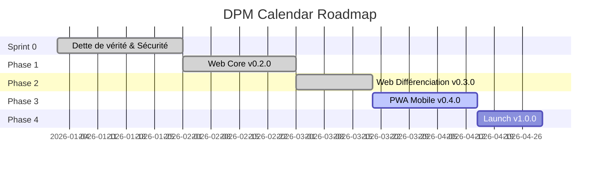

# 🗺️ Roadmap & Issues

## Phases du projet

---

## Détail des phases

### Sprint 0 — Dette de vérité & Sécurité ✅

EPIC [#77](https://github.com/ralphgabriel04/dpm-calendar/issues/77) (fermé)

| # | Titre | Statut |
|---|-------|--------|
| 78 | Client secret Google exposé dans git | ✅ Fermé |
| 79 | Auditer les fichiers .env | ✅ Fermé |
| 80 | Retirer les badges de sécurité trompeurs | ✅ Fermé |
| 81 | Retirer les fausses claims de la landing page | ✅ Fermé |
| 82 | Fix sync Google Calendar | ✅ Fermé |
| 83 | Fix sync Microsoft Outlook | ✅ Fermé |
| 84 | Remplacer données mockées dans le dashboard | ❌ Ouvert |
| 85 | Consolider Dashboard V1 et V2 | ❌ Ouvert |
| 127 | Code Audit — Dead code, composants orphelins | ✅ Fermé |
| 130 | Auth bypass — Credentials sans mot de passe | ✅ Fermé |
| 131 | Headers de sécurité HTTP | ✅ Fermé |
| 132 | Migrations Prisma (db push → migrate) | ✅ Fermé |
| 133 | Chiffrement tokens OAuth (AES-256-GCM) | ✅ Fermé |
| 134 | Fix sync PUSH + refresh token | ✅ Fermé |
| 135 | Rate limiting tRPC | ✅ Fermé |

---

### Phase 1 — Web Core v0.2.0 ✅

EPIC [#86](https://github.com/ralphgabriel04/dpm-calendar/issues/86) (fermé)

| # | Titre | Statut |
|---|-------|--------|
| 87 | AI Auto-Scheduling — "Planifier ma journée" | ✅ Fermé |
| 88 | AI Adaptive Rescheduling | ❌ Ouvert (P0) |
| 89 | Onboarding guide interactif | ✅ Fermé |
| 90 | Push Notifications (Web Push API) | ✅ Fermé |
| 91 | Privacy Policy + Terms of Service | ✅ Fermé |
| 128 | Vitest + 25 tests critiques | ✅ Fermé |
| 129 | CI/CD Pipeline + Branch Protection | ✅ Fermé |
| 137 | Morning Ritual MCII | ✅ Fermé |
| 138 | Attention Shield — Focus blocks | ✅ Fermé |
| 139 | Estimation Calibration | ✅ Fermé |
| 141 | Cognitive Offload — NLP Quick Capture | ✅ Fermé |

---

### Phase 2 — Web Différenciation v0.3.0 ✅

EPIC [#92](https://github.com/ralphgabriel04/dpm-calendar/issues/92) (fermé)

| # | Titre | Statut |
|---|-------|--------|
| 93 | Energy-Aware Scheduling | ✅ Fermé |
| 94 | Guided Morning Planning Ritual | ✅ Fermé |
| 95 | Guided Shutdown Routine | ✅ Fermé |
| 96 | Scheduling Links / Booking Pages | ❌ Ouvert |
| 97 | Time Tracking UI | ❌ Ouvert |
| 98 | Task Templates & Recurring Tasks | ❌ Ouvert |
| 99 | Workload Limit Warnings | ❌ Ouvert |
| 100 | Keyboard Shortcuts | ❌ Ouvert |
| 117 | Focus Timer Engine | ✅ Fermé |
| 118 | Focus Task Picker | ✅ Fermé |
| 119 | Focus Progress Ring | ✅ Fermé |
| 136 | Chronotype Engine | ✅ Fermé |
| 140 | Anti-Procrastination CBT | ✅ Fermé |
| 142 | Daily Priority Cap | ✅ Fermé |
| 143 | Meeting Load Management | ✅ Fermé |
| 144 | N-of-1 Experiment Lab | ✅ Fermé |

---

### Phase 3 — PWA Mobile v0.4.0 (en cours)

EPIC [#101](https://github.com/ralphgabriel04/dpm-calendar/issues/101) — ~35 story points, 3-4 semaines

| # | Titre | Priorité | Statut |
|---|-------|----------|--------|
| 102 | Service Worker + Manifest — Installation PWA | P1 | ❌ Ouvert |
| 103 | Responsive mobile — 15 features touch | P1 | ❌ Ouvert |
| 113 | Push Notifications mobile (iOS/Android) | P1 | ❌ Ouvert |
| 114 | Quick Capture mobile (Texte + Voix) | P1 | ❌ Ouvert |
| 115 | Touch-Optimized UI (44px, swipe, safe areas) | P1 | ❌ Ouvert |

**Definition of Done** : Installable iOS/Android, 60fps, offline cache, push notifications, 44px touch targets.

---

### Phase 4 — Launch v1.0.0

EPIC [#104](https://github.com/ralphgabriel04/dpm-calendar/issues/104) — 2-3 semaines

| # | Titre | Priorité | Statut |
|---|-------|----------|--------|
| 105 | Habit Scheduling dans le calendrier | P1 | ❌ Ouvert |
| 106 | Goal ↔ Task linking | P1 | ❌ Ouvert |
| 107 | Quick Capture NLP UI | P1 | ❌ Ouvert |
| 108 | AI Daily Brief | P2 | ❌ Ouvert |
| 109 | Weekly/Monthly Review auto | P2 | ❌ Ouvert |
| 110 | Import/Export CSV, ICS, JSON | P2 | ❌ Ouvert |
| 111 | Product Hunt Launch | P1 | ❌ Ouvert |
| 112 | Bug Bash + Performance Audit | P1 | ❌ Ouvert |

**Definition of Done** : Lighthouse > 90, 0 P0/P1 bugs, Privacy Policy publiée, Product Hunt listing.

---

### Focus Hub EPIC

EPIC [#116](https://github.com/ralphgabriel04/dpm-calendar/issues/116) — ~27 story points

| # | Titre | Priorité | Statut |
|---|-------|----------|--------|
| 117 | Timer Engine | P1 | ✅ Fermé |
| 118 | Task Picker | P1 | ✅ Fermé |
| 119 | Progress Ring | P1 | ✅ Fermé |
| 120 | Session Review | P2 | ❌ Ouvert |
| 121 | Focus Analytics Dashboard | P2 | ❌ Ouvert |
| 122 | Mini-timer persistant | P2 | ❌ Ouvert |
| 123 | Sons ambient | P2 | ❌ Ouvert |
| 124 | Calendar Blocking auto | P2 | ❌ Ouvert |

---

## Autres issues ouvertes

| # | Titre | Labels | Priorité |
|---|-------|--------|----------|
| 125 | Emotional Memory — Modèle Prisma dédié | refactor, architecture | P1 |
| 126 | Goals SMART complet — Milestones | feature, backend, frontend | P1 |

---

## Résumé

| Métrique | Valeur |
|----------|--------|
| Issues ouvertes | 30 |
| Issues fermées | 38+ |
| EPICs totaux | 5 (2 ouverts, 3 fermés) |
| Issues P0 ouvertes | 1 (#88) |
| Issues P1 ouvertes | 18 |
| Issues P2 ouvertes | 11 |
| PRs ouvertes | 1 (#145) |

---

## North Star Metrics

| Métrique | Cible v1.0 |
|----------|-----------|
| WAU (Weekly Active Users) | 100+ |
| Retention D7 | > 40% |
| NPS | > 30 |
| Time to Value | < 2 minutes |
